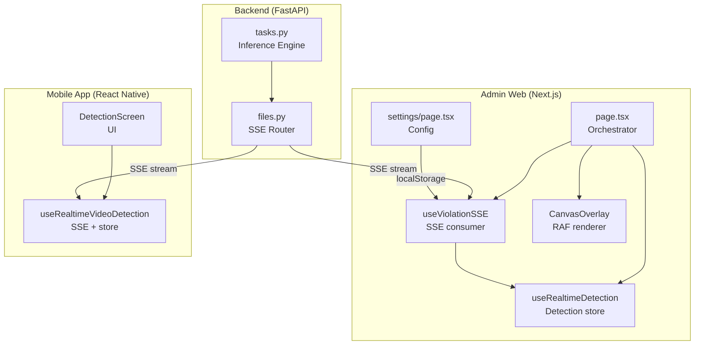

# Design Document: 3soc-detection-smooth

## Overview

Feature này nâng cấp toàn bộ pipeline phát hiện vi phạm chủ quyền Việt Nam để trải nghiệm demo trên Web và Mobile đạt chất lượng ngang với script Python test trực tiếp.

Vấn đề cốt lõi hiện tại:
- Inference YOLO thiếu tham số `imgsz`, `conf`, `iou` → kết quả kém hơn script Python
- Frame BGR không được convert sang RGB trước khi đưa vào model → sai màu đầu vào
- `stream_cached()` không emit `detection` event → FE không tính được `scanProgress`
- `CanvasOverlay` phụ thuộc React render cycle → bbox nhấp nháy
- `useRealtimeDetection` bỏ qua frame rỗng → CanvasOverlay không biết khi nào xóa box
- Mobile App không auto-start detection sau upload → UX kém

Luồng mục tiêu sau khi hoàn thành:

```
Upload video
  → Backend xử lý ngầm (SSE stream)
  → FE tính scanProgress từ detection events
  → Loading bar 0→100%
  → scanDone=true → nút "Xem phát hiện" unlock
  → Bấm Play → RAF loop đọc video.currentTime
  → Binary search tìm frame gần nhất
  → Vẽ bbox lên canvas mượt mà
```

---

## Architecture

Hệ thống gồm 3 tầng độc lập giao tiếp qua HTTP/SSE:



### Luồng dữ liệu SSE

```
Backend                          Frontend
  │                                  │
  ├─ {type:"init"}                   │
  ├─ {type:"metadata", total_frames} │→ totalFramesRef = total_frames
  ├─ {type:"detection", frame_number}│→ scanProgress = frame_number/total_frames*100
  ├─ {type:"detection", ...}         │→ appendDetectionResult(ts, boxes)
  ├─ {type:"violation", ...}         │→ appendViolation(frame)
  ├─ ...                             │
  └─ {type:"complete"}               │→ scanDone = true, scanProgress = 100
```

---

## Components and Interfaces

### Backend: tasks.py

**Hằng số inference:**
```python
INFER_IMGSZ = 640
INFER_CONF  = 0.20
INFER_IOU   = 0.45
```

**Thay đổi trong `run_detection_on_frame(frame)`:**
- Convert `frame` từ BGR sang RGB: `frame_rgb = cv2.cvtColor(frame, cv2.COLOR_BGR2RGB)`
- Truyền tham số vào model: `model(frame_rgb, imgsz=INFER_IMGSZ, conf=INFER_CONF, iou=INFER_IOU, half=False, save=False, verbose=False)`

**Thay đổi trong `run_detection_on_image_temp(image_path)`:**
- Đọc ảnh bằng OpenCV rồi convert BGR→RGB trước khi inference
- Truyền cùng tham số như trên

### Backend: files.py — stream_cached()

**Thay đổi:**
- Emit `detection` event cho mỗi violation trước khi emit `violation` event
- Dùng `total_frames = len(cached)` cho metadata (số violation frames, không phải tổng frame video)
- `cv2.imwrite(str(frame_path), frame, [cv2.IMWRITE_JPEG_QUALITY, 95])`

**Cấu trúc stream_cached mới:**
```python
def stream_cached():
    yield init_event
    yield metadata_event(total_frames=len(cached))
    for i, v in enumerate(cached):
        # Emit detection trước để FE tính progress
        yield detection_event(frame_number=i+1, timestamp=v["timestamp"], detections=v["detections"])
        yield violation_event(v)
    yield complete_event
```

### Admin Web: useViolationSSE

**Interface:**
```typescript
function useViolationSSE(params: {
  videoId: string;
  enabled: boolean;
  onViolation?: (violation: ViolationFrame) => void;
}): {
  violationFrames: ViolationFrame[];
  scanProgress: number;   // 0-100
  scanDone: boolean;
  resetViolations: () => void;
}
```

**Thay đổi:**
- Đọc `detectionFps` từ `localStorage.getItem('detectionFps')` khi khởi tạo SSE, fallback 50ms
- `totalFramesRef` lưu `total_frames` từ `metadata` event
- `scanProgress` tính từ `detection` event: `Math.min(99, Math.round((frame_number / total_frames) * 100))`
- `resetViolations()` reset: `violationFrames=[]`, `scanProgress=0`, `scanDone=false`, `totalFramesRef.current=0`

### Admin Web: useRealtimeDetection

**Thay đổi:**
- `appendDetectionResult(timestamp, boxes)` luôn lưu entry kể cả khi `boxes=[]`
- `MAX_RESULT_ENTRIES = 2000`
- Eviction: xóa entry có timestamp nhỏ nhất khi vượt giới hạn

### Admin Web: CanvasOverlay

**Props:**
```typescript
interface CanvasOverlayProps {
  videoRef: React.RefObject<HTMLVideoElement | null>;
  detectionResults: Map<number, BoundingBox[]>;
  enabled: boolean;
}
```

**Kiến trúc RAF độc lập:**
- `requestAnimationFrame` loop đọc `video.currentTime * 1000` trực tiếp
- Không phụ thuộc React state hay re-render
- `ResizeObserver` sync kích thước canvas với video element

**Binary search tìm frame:**
```
timestamps đã sort → binary search tìm insertIdx
prevTs = timestamps[insertIdx - 1]  // frame vừa qua
nextTs = timestamps[insertIdx]      // frame sắp tới

Hiện box nếu: currentMs - prevTs <= 80ms
Nhìn trước nếu: nextTs - currentMs <= 20ms
```

**Empty frame debounce:**
- `emptyFrameCountRef` đếm frame rỗng liên tiếp
- Chỉ xóa box khi `emptyFrameCountRef >= EMPTY_FRAME_THRESHOLD (= 2)`
- Reset counter khi gặp frame có box

**Màu và label:**
```typescript
const MODEL_COLORS = { co3soc: '#FF0000', duongluoibo: '#00FF00', vnmap: '#0000FF' }
const LABEL_VI     = { co3soc: 'Cờ 3 sọc', duongluoibo: 'Đường lưỡi bò', vnmap: 'VN' }
```

### Admin Web: page.tsx

**Thay đổi:**
- Bỏ `currentTimestamp` state và RAF sync riêng
- SSE tự động mở khi `mediaType === 'video' && !!videoId` (bỏ điều kiện `isDetecting`)
- Đóng SSE cũ trước khi reset khi upload file mới
- Truyền `videoRef` và `detectionResults` thẳng vào `CanvasOverlay`
- Loading bar từ `scanProgress`, nút disabled cho đến `scanDone`

### Admin Web: settings/page.tsx

**Thay đổi:**
- Input `detectionFps`: `min=50`, `max=200`, `step=10`
- Lưu vào `localStorage` khi thay đổi

### Mobile App: useRealtimeVideoDetection

**Hằng số:**
```typescript
const DETECT_SAMPLE_MS = 200;           // hardcode, không có UI thay đổi
const BOX_STALE_MS     = DETECT_SAMPLE_MS * 2;  // = 400ms
```

**State mới:**
```typescript
const [scanDone, setScanDone]       = useState(false);
const [scanProgress, setScanProgress] = useState(0);
```

**Xử lý SSE events:**
- `metadata` → lưu `total_frames`, reset progress
- `detection` → tính `scanProgress`, gọi `appendVideoDetection`
- `violation` → gọi `appendViolation`
- `complete` → `setScanDone(true)`, `setScanProgress(100)`

**Interface trả về:**
```typescript
return {
  isDetecting, violationFrames, currentVideoBoxes,
  scanDone, scanProgress,
  startVideoDetection, stopDetection, resetRealtimeState,
}
```

### Mobile App: DetectionScreen

**Thay đổi:**
- Auto gọi `startVideoDetection()` sau khi upload thành công
- Hiện loading indicator "Đang xử lý video..." + progress bar khi `!scanDone`
- Nút "Xem phát hiện" unlock khi `scanDone=true`
- Horizontal scroll violation thumbnails (FlatList horizontal)
- Detail modal với `BoundingBoxOverlay` khi tap thumbnail

---

## Data Models

### SSE Event Payloads

```typescript
// init
{ type: "init", detection_id: string }

// metadata
{ type: "metadata", total_frames: number, fps: number | null }

// detection (mỗi frame được xử lý)
{
  type: "detection",
  data: {
    frame_number: number,
    timestamp: number,      // milliseconds
    detections: BoundingBox[]
  }
}

// violation (frame có vi phạm, được lưu ảnh)
{
  type: "violation",
  data: {
    frame_number: number,
    timestamp: number,
    image_path: string,     // "/uploads/violations/{id}/{filename}"
    detections: BoundingBox[]
  }
}

// complete
{ type: "complete", total_violations: number }
```

### BoundingBox (normalized format)

```typescript
interface BoundingBox {
  x: number;          // pixel, top-left
  y: number;          // pixel, top-left
  width: number;      // pixel
  height: number;     // pixel
  label: string;      // "co3soc" | "duongluoibo" | "vnmap"
  confidence: number; // 0.0 - 1.0
}
```

### Detection Store (Admin Web)

```typescript
// Map<timestamp_ms, BoundingBox[]>
// Giới hạn 2000 entries, oldest-first eviction
detectionResults: Map<number, BoundingBox[]>
```

### ViolationFrame

```typescript
interface ViolationFrame {
  frame_number: number;
  timestamp: number;    // milliseconds
  image_path: string;
  detections: BoundingBox[];
}
```

### localStorage Keys (Admin Web)

| Key | Type | Default | Mô tả |
|-----|------|---------|-------|
| `detectionFps` | number (ms) | 50 | Khoảng cách giữa các frame lấy mẫu |

---

## Correctness Properties

*A property is a characteristic or behavior that should hold true across all valid executions of a system — essentially, a formal statement about what the system should do. Properties serve as the bridge between human-readable specifications and machine-verifiable correctness guarantees.*

### Property 1: stream_cached detection-before-violation ordering

*For any* danh sách cached violations, khi stream_cached() emit events, mỗi `violation` event phải được preceded bởi ít nhất một `detection` event có cùng `timestamp`.

**Validates: Requirements 2.2**

### Property 2: detectionFps input range validation

*For any* giá trị input cho `detectionFps`, giá trị được lưu vào localStorage phải nằm trong khoảng `[50, 200]` — giá trị nhỏ hơn 50 bị clamp về 50, lớn hơn 200 bị clamp về 200.

**Validates: Requirements 3.3**

### Property 3: State reset completeness

*For any* trạng thái trước đó của hệ thống (bất kỳ giá trị scanProgress, scanDone, violationFrames nào), sau khi gọi reset (upload file mới hoặc resetViolations()), tất cả state phải trở về giá trị khởi tạo: `scanProgress=0`, `scanDone=false`, `violationFrames=[]`.

**Validates: Requirements 4.6, 5.5, 9.5**

### Property 4: scanProgress formula correctness

*For any* giá trị `frame_number` và `total_frames > 0`, `scanProgress` được tính bởi useViolationSSE phải bằng `Math.min(99, Math.round((frame_number / total_frames) * 100))` — không bao giờ đạt 100 cho đến khi nhận event `complete`.

**Validates: Requirements 5.3**

### Property 5: resetViolations idempotency

*For any* trạng thái của useViolationSSE, gọi `resetViolations()` nhiều lần liên tiếp phải cho kết quả giống nhau như gọi một lần — `f(x) = f(f(x))`.

**Validates: Requirements 5.6**

### Property 6: appendDetectionResult stores empty boxes

*For any* timestamp hợp lệ, khi `appendDetectionResult(timestamp, [])` được gọi, `detectionResults.get(timestamp)` phải trả về `[]` (không phải `undefined`).

**Validates: Requirements 6.1**

### Property 7: detectionResults size invariant

*For any* số lần gọi `appendDetectionResult()` bất kỳ (kể cả hàng nghìn lần), `detectionResults.size` phải luôn `<= MAX_RESULT_ENTRIES (= 2000)`.

**Validates: Requirements 6.2, 6.4**

### Property 8: Oldest-first eviction

*For any* `detectionResults` đã đầy (size = 2000), khi thêm một entry mới, entry bị xóa phải là entry có timestamp nhỏ nhất trong map — không phải entry ngẫu nhiên hay entry mới nhất.

**Validates: Requirements 6.3**

### Property 9: Binary search correctness

*For any* danh sách timestamps đã sắp xếp và giá trị `currentMs` bất kỳ, kết quả của binary search trong `findBoxes()` phải trả về cùng frame gần nhất như linear search — kết quả không phụ thuộc vào thuật toán tìm kiếm.

**Validates: Requirements 7.2, 7.8**

### Property 10: BoundingBox display window

*For any* `currentMs` và `prevTimestamp`, CanvasOverlay phải hiển thị boxes của `prevTimestamp` khi và chỉ khi `currentMs - prevTimestamp <= 80`.

**Validates: Requirements 7.3**

### Property 11: Empty frame threshold debounce

*For any* chuỗi frames, CanvasOverlay chỉ xóa boxes khi có ít nhất `EMPTY_FRAME_THRESHOLD (= 2)` frames rỗng liên tiếp — một frame rỗng đơn lẻ không được xóa boxes đang hiển thị.

**Validates: Requirements 7.4**

### Property 12: Color and label mapping consistency

*For any* model name trong tập `{co3soc, duongluoibo, vnmap}`, mapping màu và label tiếng Việt phải nhất quán trên mọi component (CanvasOverlay, Admin Web UI, Mobile App):
- `co3soc` → `#FF0000`, `"Cờ 3 sọc"`
- `duongluoibo` → `#00FF00`, `"Đường lưỡi bò"`
- `vnmap` → `#0000FF`, `"VN"`

**Validates: Requirements 7.6, 7.7, 8.3, 11.4, 12.1, 12.2, 12.3**

### Property 13: Confidence formatting

*For any* giá trị `confidence` trong `[0, 1]`, khi hiển thị trên Admin Web, kết quả phải là số nguyên phần trăm không có chữ số thập phân (ví dụ: `0.873` → `"87%"`).

**Validates: Requirements 8.4**

### Property 14: BOX_STALE_MS invariant

*For any* giá trị `DETECT_SAMPLE_MS` hợp lệ, `BOX_STALE_MS` phải luôn bằng `DETECT_SAMPLE_MS * 2`. Với `DETECT_SAMPLE_MS = 200`, `BOX_STALE_MS = 400`.

**Validates: Requirements 10.1, 10.2**

### Property 15: Stale box not displayed

*For any* `currentPositionMs` và `detectionTimestamp`, Mobile App không được hiển thị BoundingBox khi `currentPositionMs - detectionTimestamp > BOX_STALE_MS`.

**Validates: Requirements 10.3**

---

## Error Handling

### Backend

| Tình huống | Xử lý |
|-----------|-------|
| Model không load được | Log lỗi, bỏ qua model đó, tiếp tục với các model còn lại |
| Frame decode lỗi | Log lỗi, bỏ qua frame, tiếp tục |
| DB insert lỗi | `db.rollback()`, log lỗi, tiếp tục stream (không crash) |
| Video file không tồn tại | HTTP 404 |
| BGR→RGB convert lỗi | Fallback: dùng frame gốc, log warning |

### Admin Web

| Tình huống | Xử lý |
|-----------|-------|
| SSE connection lỗi | Log warning, EventSource tự reconnect |
| Upload lỗi | `console.error`, không set `videoId` → SSE không mở |
| localStorage không có `detectionFps` | Fallback về 50ms |
| `total_frames = 0` trong metadata | Không tính progress, giữ `scanProgress = 0` |
| Video element chưa sẵn sàng trong RAF | Guard `if (!video || !canvas) return` |

### Mobile App

| Tình huống | Xử lý |
|-----------|-------|
| Upload lỗi | `Alert.alert('Upload lỗi', ...)`, không auto-start detection |
| SSE parse lỗi | `try/catch`, bỏ qua chunk lỗi |
| Seek lỗi | `try/catch`, ignore |
| `total_frames = 0` | Không tính progress |

---

## Testing Strategy

### Dual Testing Approach

Sử dụng kết hợp unit tests và property-based tests:
- **Unit tests**: kiểm tra ví dụ cụ thể, edge cases, integration points
- **Property tests**: kiểm tra các invariants và rules trên nhiều inputs ngẫu nhiên

### Property-Based Testing

**Library:**
- TypeScript (Admin Web, Mobile): [fast-check](https://github.com/dubzzz/fast-check)
- Python (Backend): [hypothesis](https://hypothesis.readthedocs.io/)

**Cấu hình:** Mỗi property test chạy tối thiểu 100 iterations.

**Tag format:** `// Feature: 3soc-detection-smooth, Property {N}: {property_text}`

Mỗi correctness property trong design document phải được implement bởi đúng một property-based test.

### Unit Tests

Tập trung vào:
- Ví dụ cụ thể: hằng số inference, cấu trúc SSE events, localStorage fallback
- Integration: upload → SSE open, scanDone → button unlock
- Edge cases: `total_frames=0`, `boxes=[]`, `confidence=0`, `confidence=1`

Tránh viết quá nhiều unit tests cho các trường hợp đã được property tests cover.

### Test Coverage theo Component

**Backend (Python/Hypothesis):**
- `test_stream_cached_ordering`: Property 1 — detection trước violation
- `test_inference_params`: Unit — hằng số INFER_IMGSZ, INFER_CONF, INFER_IOU
- `test_jpeg_quality`: Unit — cv2.imwrite với quality 95

**Admin Web (TypeScript/fast-check):**
- `test_detection_fps_range`: Property 2 — clamp [50, 200]
- `test_state_reset`: Property 3 — reset completeness
- `test_scan_progress_formula`: Property 4 — công thức scanProgress
- `test_reset_violations_idempotent`: Property 5 — idempotency
- `test_append_empty_boxes`: Property 6 — lưu entry rỗng
- `test_detection_results_size`: Property 7 — size <= 2000
- `test_oldest_first_eviction`: Property 8 — eviction policy
- `test_binary_search_correctness`: Property 9 — binary search vs linear search
- `test_bbox_display_window`: Property 10 — 80ms window
- `test_empty_frame_threshold`: Property 11 — debounce 2 frames
- `test_color_label_mapping`: Property 12 — màu và label
- `test_confidence_formatting`: Property 13 — format phần trăm

**Mobile App (TypeScript/fast-check):**
- `test_box_stale_ms_invariant`: Property 14 — BOX_STALE_MS = DETECT_SAMPLE_MS * 2
- `test_stale_box_not_displayed`: Property 15 — không hiển thị box stale
- `test_state_reset_mobile`: Property 3 (mobile variant)
